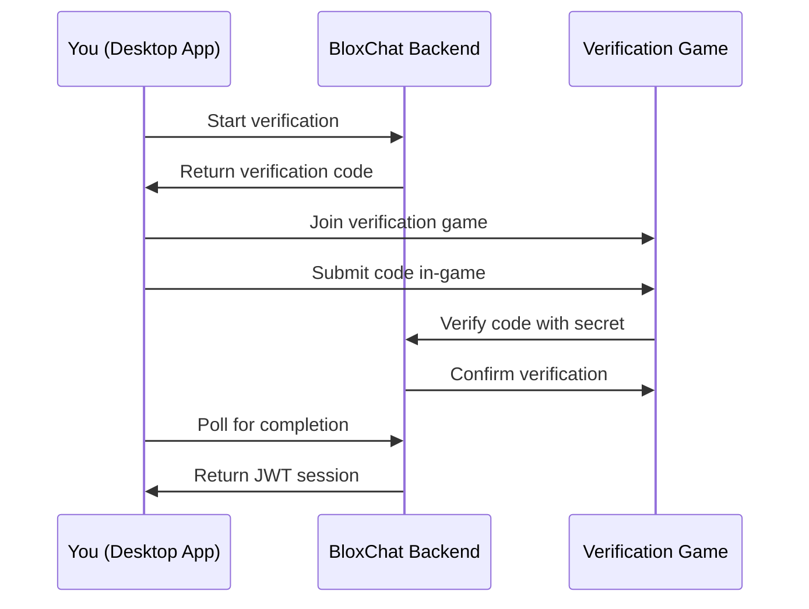

BloxChat uses a secure verification flow to authenticate your Roblox account without requiring your password or cookies. This guide explains how verification works and how to complete it successfully.

## Why Verification Is Needed

BloxChat requires verification to ensure:

<CardGroup cols={2}>
  <Card title="Secure Authentication" icon="shield-check">
    Verify your Roblox identity without sharing passwords or account credentials
  </Card>
  
  <Card title="Authorized Access" icon="key">
    Ensure only legitimate Roblox users can access chat channels
  </Card>
  
  <Card title="Session Management" icon="clock">
    Maintain secure, time-limited sessions that automatically expire
  </Card>
  
  <Card title="Privacy Protection" icon="lock">
    Keep your Roblox account secure while using BloxChat services
  </Card>
</CardGroup>

<Note>
  BloxChat never asks for your Roblox password, email, or authentication cookies. The verification process only confirms you control the Roblox account.
</Note>

## How Verification Works

The verification system uses a secure challenge-response process.

### Architecture Overview

### Step-by-Step Process

<Steps>
  <Step title="Request a verification code">
    When you click **Start Verification** in BloxChat, the app requests a unique verification code from the backend server.
    
    **What happens:**
    - A random 6-digit code is generated
    - The code is tied to your verification session
    - The session is valid for 10 minutes
  </Step>
  
  <Step title="Join the verification game">
    BloxChat displays your verification code and provides a button to join the verification game on Roblox.
    
    **What happens:**
    - The verification Place ID is retrieved from server configuration
    - Clicking **Join verification game** opens the game in Roblox
    - Your verification code remains visible while the game loads
  </Step>
  
  <Step title="Submit your code in-game">
    Inside the verification game, enter your 6-digit code when prompted.
    
    **What happens:**
    - The game sends your code and Roblox User ID to the backend
    - The backend validates the code matches your session
    - Your Roblox profile is fetched and verified
  </Step>
  
  <Step title="Verification completes">
    BloxChat detects the successful verification and logs you in automatically.
    
    **What happens:**
    - The backend creates a JWT (JSON Web Token) for your session
    - Your user profile (username, display name, user ID) is stored
    - BloxChat receives the session token and marks you as authenticated
    - You're redirected to the main chat interface
  </Step>
</Steps>

## Session Management

Verification creates a time-limited session that grants access to BloxChat.

### Session Lifetime

<Tabs>
  <Tab title="Verification Session">
    **Duration**: 10 minutes
    
    This is the window you have to complete verification after clicking **Start Verification**.
    
    **Countdown timer:**
    - Displayed under your verification code
    - Shows remaining seconds
    - Automatically refreshes every second
    
    <Warning>
      If the verification session expires, you must click **Start Verification** again to get a new code.
    </Warning>
  </Tab>
  
  <Tab title="Authenticated Session">
    **Duration**: 1 hour (default)
    
    After successful verification, your authenticated session lasts 1 hour.
    
    **What happens when it expires:**
    - You're logged out automatically
    - You must complete verification again
    - Your chat history is preserved on the server
    
    <Note>
      Session duration is configured by the backend server. Self-hosted instances may use different expiry times.
    </Note>
  </Tab>
  
  <Tab title="Session Refresh">
    BloxChat can automatically refresh your session before it expires.
    
    **How it works:**
    - Before your JWT expires, BloxChat requests a session refresh
    - Your Roblox profile is re-validated
    - A new JWT is issued with extended expiry
    
    **Rate limits:**
    - Maximum 4 refresh requests per hour
    - Prevents abuse and excessive API calls
    
    <Tip>
      Keep BloxChat running in the background to maintain your session without re-verification.
    </Tip>
  </Tab>
</Tabs>

## Completing Verification Successfully

Follow these steps to ensure smooth verification.

<Steps>
  <Step title="Start verification at the right time">
    Only start verification when you're ready to join the game immediately. Don't wait—the 10-minute timer starts as soon as you click **Start Verification**.
  </Step>
  
  <Step title="Keep BloxChat open">
    Don't close BloxChat while joining the verification game. The app needs to stay running to detect when verification completes.
  </Step>
  
  <Step title="Enter the code accurately">
    Double-check your verification code before submitting it in-game. The code is case-insensitive but must match exactly.
    
    <Tip>
      The verification code is displayed in a large, easy-to-read font with letter spacing for clarity.
    </Tip>
  </Step>
  
  <Step title="Wait for confirmation">
    After submitting your code in the verification game, wait for BloxChat to detect the successful verification. This usually takes 2-5 seconds.
    
    **What you'll see:**
    - The login screen automatically transitions to the welcome screen
    - Your Roblox username and display name appear
    - A "Go to chat" button becomes available
  </Step>
</Steps>

## Verification Security

BloxChat's verification flow is designed with security in mind.

### Security Features

<AccordionGroup>
  <Accordion title="No password required">
    BloxChat never asks for your Roblox password. Verification proves you control the account without exposing credentials.
  </Accordion>
  
  <Accordion title="Time-limited codes">
    Verification codes expire after 10 minutes, preventing replay attacks or delayed abuse.
  </Accordion>
  
  <Accordion title="Single-use codes">
    Each verification code can only be used once. After successful verification, the code is invalidated.
  </Accordion>
  
  <Accordion title="Server-side validation">
    The verification game uses a secret key to authenticate with the backend. Only authorized games can complete verification.
  </Accordion>
  
  <Accordion title="Rate limiting">
    Verification requests are rate-limited to prevent brute-force attacks:
    - 20 verification attempts per minute per user
    - 60 status checks per minute per session
    - 4 session refreshes per hour per user
  </Accordion>
  
  <Accordion title="JWT-based sessions">
    Authenticated sessions use industry-standard JWT tokens with expiration times, ensuring sessions can't be used indefinitely.
  </Accordion>
</AccordionGroup>

### What BloxChat Stores

During and after verification, BloxChat stores:

**On the backend:**
- Your Roblox User ID (numeric)
- Your Roblox username
- Your Roblox display name
- Verification session data (temporary, auto-deleted after 10 minutes)

**On your device:**
- Your JWT session token (in local storage)
- App settings and preferences
- Favorited media URLs

<Note>
  BloxChat does not store your Roblox password, email, authentication cookies, or any other sensitive account information.
</Note>

## Re-Verification

You'll need to verify again in certain situations.

### When Re-Verification Is Required

<Tabs>
  <Tab title="Session Expiration">
    **When it happens:**
    - Your JWT session expires (default: 1 hour)
    - You close BloxChat and your session isn't refreshed
    - The backend restarts and sessions are cleared
    
    **What to do:**
    1. Click **Start Verification** on the login screen
    2. Complete the verification flow again
    3. You'll be logged back in with a fresh session
  </Tab>
  
  <Tab title="Logout">
    **When it happens:**
    - You manually log out from Settings
    - You click "Log out" button
    
    **What to do:**
    1. Your session is immediately invalidated
    2. Click **Start Verification** to log back in
    3. Complete verification to access chat again
  </Tab>
  
  <Tab title="API Server Change">
    **When it happens:**
    - You change the API Server URL in Settings
    - You switch from hosted to local backend (or vice versa)
    
    **What to do:**
    1. BloxChat reloads with the new API configuration
    2. Your previous session is no longer valid
    3. Complete verification with the new backend
    
    <Warning>
      Sessions from one backend server cannot be used on another. Each server maintains its own verification and session state.
    </Warning>
  </Tab>
</Tabs>

### Avoiding Frequent Re-Verification

<Tips>
  <Tip>
    **Keep BloxChat running**: If you keep the app open, it will automatically refresh your session before it expires.
  </Tip>
  
  <Tip>
    **Don't log out unnecessarily**: Only log out if you need to switch accounts or troubleshoot authentication issues.
  </Tip>
  
  <Tip>
    **Use the default backend**: The official hosted backend has higher uptime and more reliable session management than local development servers.
  </Tip>
</Tips>

## Troubleshooting Verification

If verification isn't working, see the [Troubleshooting Guide](/guides/troubleshooting) for detailed solutions.

### Quick Fixes

<AccordionGroup>
  <Accordion title="Verification code expired">
    **Symptom**: Message says "Verification code expired" in-game or BloxChat.
    
    **Solution**: Click **Start Verification** again to get a new code.
  </Accordion>
  
  <Accordion title="Invalid verification code">
    **Symptom**: Game says "Invalid or expired verification code."
    
    **Solution**: 
    - Double-check you entered the code correctly
    - Ensure you copied the full 6-digit code
    - Verify you're using the most recent code (not an old one)
  </Accordion>
  
  <Accordion title="Verification game won't load">
    **Symptom**: Clicking "Join verification game" does nothing or fails.
    
    **Solution**:
    - Check your internet connection
    - Verify Roblox is installed and working
    - Try opening the game manually through Roblox website
    - Contact support if the verification Place ID is invalid
  </Accordion>
  
  <Accordion title="Verification completes but login fails">
    **Symptom**: Code is accepted in-game, but BloxChat doesn't log you in.
    
    **Solution**:
    - Wait 5-10 seconds for BloxChat to poll for completion
    - Check your API Server URL is correct in Settings
    - Restart BloxChat and try again
    - Verify you're not rate-limited (wait 1 minute and retry)
  </Accordion>
</AccordionGroup>

## Next Steps

<CardGroup cols={2}>
  <Card title="Using the App" icon="comments" href="/guides/using-the-app">
    Learn how to use BloxChat after successful verification
  </Card>
  
  <Card title="Troubleshooting" icon="wrench" href="/guides/troubleshooting">
    Resolve verification errors and issues
  </Card>
</CardGroup>