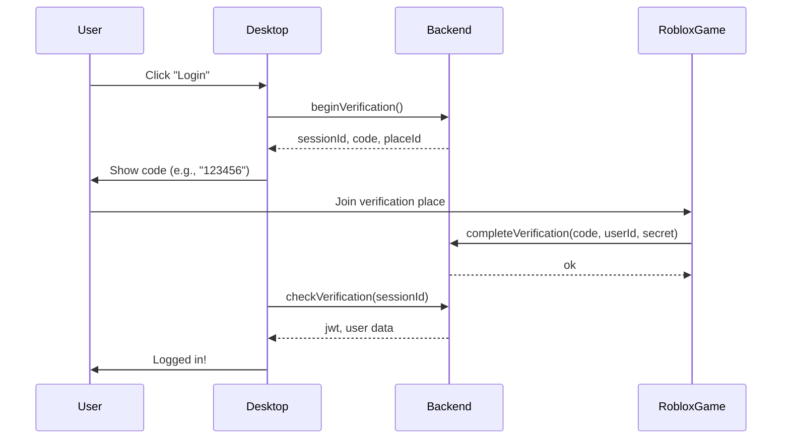

## Overview

For BloxChat to work, your Roblox game must integrate with the backend to complete the verification flow. This allows users to prove their Roblox identity and receive a JWT session token.

<Note>
  Game integration is **required** for self-hosting. Without it, users cannot log in.
</Note>

## How Verification Works

The verification flow involves multiple components:



<Steps>
  <Step title="Desktop app begins verification">
    User clicks login. Desktop calls `auth.beginVerification` and receives:
    - `sessionId`: UUID for polling
    - `code`: 6-digit verification code (e.g., "123456")
    - `placeId`: Where to verify
    - `expiresAt`: Expiration timestamp (10 minutes)
  </Step>

  <Step title="User joins verification place">
    Desktop displays the code and directs user to join the Roblox place at `placeId`.
  </Step>

  <Step title="Game calls completeVerification">
    When user joins, the Roblox game server script:
    1. Gets the verification code from the user (via GUI or chat)
    2. Calls `auth.completeVerification` endpoint with:
       - `code`: Verification code
       - `robloxUserId`: User's Roblox ID
       - `x-verification-secret`: Shared secret header
  </Step>

  <Step title="Backend validates and completes">
    Backend:
    1. Validates `x-verification-secret` header
    2. Checks if code exists and hasn't expired
    3. Fetches Roblox user profile
    4. Creates JWT session
    5. Marks verification as complete
  </Step>

  <Step title="Desktop polls for completion">
    Desktop periodically calls `auth.checkVerification` with `sessionId`:
    - `pending`: Still waiting
    - `verified`: Success, returns JWT and user data
    - `expired`: Session timeout, must restart
  </Step>
</Steps>

## Backend API Endpoints

Your Roblox game interacts with these tRPC endpoints.

### Complete Verification Endpoint

**Procedure:** `auth.completeVerification`  
**Type:** Mutation (HTTP POST)  
**Middleware:** `gameVerificationProcedure` (requires `x-verification-secret` header)

**Input Schema:**
```typescript
{
  code: string,           // 6-12 character verification code
  robloxUserId: string    // Numeric Roblox user ID
}
```

**Required Header:**
```
x-verification-secret: <your_verification_secret>
```

**Response:**
```typescript
{ ok: true }
```

**Errors:**
- `UNAUTHORIZED`: Invalid or missing verification secret
- `BAD_REQUEST`: Invalid/expired code
- `TOO_MANY_REQUESTS`: Rate limit exceeded (20 requests per minute per user)

**Source:** `packages/api/src/routers/auth.ts:102-152`

### Verification Secret Validation

The backend validates the secret using timing-safe comparison:

```typescript packages/api/src/trpc.ts
const hasVerificationSecret = middleware(async ({ ctx, next }) => {
  const secretHeader = ctx.headers["x-verification-secret"];
  const providedSecret = Array.isArray(secretHeader) ? secretHeader[0] : secretHeader;
  
  if (!providedSecret || !isValidVerificationSecret(providedSecret)) {
    throw new TRPCError({
      code: "UNAUTHORIZED",
      message: "Invalid verification secret",
    });
  }
  
  return next();
});

function isValidVerificationSecret(providedSecret: string) {
  const expectedSecret = env.VERIFICATION_SECRET;
  if (providedSecret.length !== expectedSecret.length) return false;
  
  return crypto.timingSafeEqual(
    Buffer.from(providedSecret),
    Buffer.from(expectedSecret),
  );
}
```

<Warning>
  The secret must be **exactly** the same length as configured in `VERIFICATION_SECRET`. Timing-safe comparison prevents timing attacks.
</Warning>

## Roblox Game Integration

Implement server-side verification in your Roblox game.

### Prerequisites

<Steps>
  <Step title="Enable HTTP requests">
    In Roblox Studio:
    1. Home → Game Settings → Security
    2. Enable **"Allow HTTP Requests"**
    3. Save and publish
  </Step>

  <Step title="Configure verification place">
    Set `VERIFICATION_PLACE_ID` in backend `.env` to your place ID:
    
    ```env apps/server/.env
    VERIFICATION_PLACE_ID=123456789
    ```
  </Step>

  <Step title="Store verification secret in game">
    Store `VERIFICATION_SECRET` securely in a server script. Never expose to client.
  </Step>
</Steps>

### Server Script Implementation

Create a server script (ServerScriptService) to handle verification:

```lua ServerScriptService/BloxChatVerification
local HttpService = game:GetService("HttpService")
local Players = game:GetService("Players")

-- Configuration (store securely, never expose to client)
local API_URL = "https://your-api-domain.com"  -- Your backend URL
local VERIFICATION_SECRET = "your_verification_secret_64_chars_minimum"  -- From backend .env
local VERIFICATION_ENDPOINT = API_URL .. "/trpc/auth.completeVerification"

-- Function to complete verification
local function completeVerification(player: Player, code: string)
	local success, result = pcall(function()
		local response = HttpService:RequestAsync({
			Url = VERIFICATION_ENDPOINT,
			Method = "POST",
			Headers = {
				["Content-Type"] = "application/json",
				["x-verification-secret"] = VERIFICATION_SECRET,
			},
			Body = HttpService:JSONEncode({
				code = code,
				robloxUserId = tostring(player.UserId),
			}),
		})
		
		return HttpService:JSONDecode(response.Body)
	end)
	
	if success and result and result.ok then
		print("Verification successful for", player.Name)
		return true
	else
		warn("Verification failed for", player.Name, ":", result)
		return false
	end
end

-- Example: Verify on join (if code stored in DataStore)
Players.PlayerAdded:Connect(function(player)
	-- In practice, get code from user via GUI or chat
	local code = getCodeFromPlayer(player)  -- Your implementation
	
	if code then
		completeVerification(player, code)
	end
end)

-- Example: Verify via RemoteEvent from client GUI
local verifyRemote = Instance.new("RemoteEvent")
verifyRemote.Name = "VerifyBloxChat"
verifyRemote.Parent = game:GetService("ReplicatedStorage")

verifyRemote.OnServerEvent:Connect(function(player, code)
	-- Validate code format
	if typeof(code) ~= "string" or #code < 6 or #code > 12 then
		warn("Invalid code format from", player.Name)
		return
	end
	
	local success = completeVerification(player, code)
	
	-- Optionally notify client of result
	verifyRemote:FireClient(player, success)
end)
```

### Client GUI (Optional)

Create a simple GUI for users to enter their verification code:

```lua StarterGui/VerificationGui/LocalScript
local ReplicatedStorage = game:GetService("ReplicatedStorage")
local verifyRemote = ReplicatedStorage:WaitForChild("VerifyBloxChat")

local gui = script.Parent
local codeInput = gui:WaitForChild("CodeInput")  -- TextBox
local submitButton = gui:WaitForChild("SubmitButton")  -- TextButton
local statusLabel = gui:WaitForChild("StatusLabel")  -- TextLabel

submitButton.MouseButton1Click:Connect(function()
	local code = codeInput.Text:gsub("%s+", "")  -- Remove whitespace
	
	if #code < 6 then
		statusLabel.Text = "Code must be at least 6 characters"
		return
	end
	
	statusLabel.Text = "Verifying..."
	submitButton.Enabled = false
	
	-- Send to server
	verifyRemote:FireServer(code)
end)

-- Listen for result
verifyRemote.OnClientEvent:Connect(function(success)
	submitButton.Enabled = true
	
	if success then
		statusLabel.Text = "Verification successful! You can close Roblox now."
		statusLabel.TextColor3 = Color3.fromRGB(0, 255, 0)
	else
		statusLabel.Text = "Verification failed. Check your code and try again."
		statusLabel.TextColor3 = Color3.fromRGB(255, 0, 0)
	end
end)
```

### Alternative: Chat Command

Allow users to verify via chat command:

```lua ServerScriptService/ChatCommands
local Players = game:GetService("Players")
local TextChatService = game:GetService("TextChatService")

Players.PlayerAdded:Connect(function(player)
	player.Chatted:Connect(function(message)
		-- Check for /verify command
		local code = message:match("^/verify%s+(%w+)$")
		
		if code then
			local success = completeVerification(player, code)
			
			if success then
				-- Send confirmation message to player
				local function sendMessage(text)
					local textChannel = TextChatService.TextChannels.RBXGeneral
					textChannel:DisplaySystemMessage(text)
				end
				
				sendMessage("BloxChat verification successful! You can close Roblox now.")
			else
				sendMessage("BloxChat verification failed. Check your code.")
			end
		end
	end)
end)
```

## Security Best Practices

<Warning>
  Follow these practices to keep your integration secure.
</Warning>

<Steps>
  <Step title="Never expose VERIFICATION_SECRET to clients">
    Store the secret **only** in server scripts. Never:
    - Send to client via RemoteEvent/RemoteFunction
    - Store in ReplicatedStorage or client-accessible locations
    - Log or print in game output
  </Step>

  <Step title="Validate user input">
    Always validate the verification code:
    
    ```lua
    if typeof(code) ~= "string" or #code < 6 or #code > 12 then
      warn("Invalid code format")
      return false
    end
    ```
  </Step>

  <Step title="Rate limit verification attempts">
    The backend has built-in rate limiting (20 requests/minute per user), but you can add additional client-side checks:
    
    ```lua
    local lastAttempt = {}
    
    local function canAttemptVerification(player)
      local now = tick()
      local last = lastAttempt[player.UserId] or 0
      
      if now - last < 5 then  -- 5 second cooldown
        return false
      end
      
      lastAttempt[player.UserId] = now
      return true
    end
    ```
  </Step>

  <Step title="Use HTTPS in production">
    Always use HTTPS for your API URL:
    
    ```lua
    local API_URL = "https://your-api-domain.com"  -- HTTPS
    ```
    
    HTTP connections expose the verification secret in transit.
  </Step>

  <Step title="Handle errors gracefully">
    Wrap HTTP requests in `pcall` and handle failures:
    
    ```lua
    local success, result = pcall(function()
      return HttpService:RequestAsync({...})
    end)
    
    if not success then
      warn("HTTP request failed:", result)
      return false
    end
    ```
  </Step>
</Steps>

## Testing the Integration

<Steps>
  <Step title="Start your backend server">
    ```bash
    cd bloxchat
    bun run start
    ```
    
    Ensure it's accessible at the URL configured in your game.
  </Step>

  <Step title="Publish your Roblox game">
    1. Add the server script to ServerScriptService
    2. Set `VERIFICATION_SECRET` in the script
    3. Publish to Roblox
  </Step>

  <Step title="Test the flow">
    1. Launch BloxChat desktop app
    2. Set API URL to your backend (Settings)
    3. Click "Login"
    4. Note the verification code
    5. Join your Roblox verification place
    6. Enter code via GUI or chat command
    7. Desktop app should complete login
  </Step>

  <Step title="Check logs">
    Monitor both backend and Roblox output for errors:
    
    **Backend logs:**
    ```bash
    # Look for verification requests
    tRPC server running at http://localhost:3000
    ```
    
    **Roblox Output:**
    ```
    Verification successful for PlayerName
    ```
  </Step>
</Steps>

## Troubleshooting

<AccordionGroup>
  <Accordion title="401 Unauthorized - Invalid verification secret">
    The `x-verification-secret` header doesn't match backend config.
    
    **Checks:**
    - Verify `VERIFICATION_SECRET` in `apps/server/.env`
    - Verify secret in Roblox server script matches exactly
    - Ensure no extra whitespace or quotes
    - Secrets must be exact same length (timing-safe comparison)
    
    **Example:**
    ```lua
    -- Correct
    local VERIFICATION_SECRET = "abc123xyz789..."
    
    -- Incorrect (extra quotes)
    local VERIFICATION_SECRET = '"abc123xyz789..."'
    ```
  </Accordion>

  <Accordion title="400 Bad Request - Invalid or expired code">
    The verification code is incorrect or has expired.
    
    **Checks:**
    - Code expires after 10 minutes
    - Code can only be used once
    - Ensure code is typed correctly (case-sensitive)
    - Desktop app must call `beginVerification` first
  </Accordion>

  <Accordion title="429 Too Many Requests - Rate limit">
    Too many verification attempts from this user.
    
    **Backend limits:**
    - 20 requests per minute per `robloxUserId`
    
    Wait and try again. Check for bugs causing repeated requests.
  </Accordion>

  <Accordion title="HTTP requests fail in Roblox">
    **Enable HTTP requests:**
    1. Roblox Studio → Home → Game Settings
    2. Security tab
    3. Enable "Allow HTTP Requests"
    4. Save and republish
    
    **Check API URL:**
    - Verify URL is correct (include `https://`)
    - Test in browser: `https://your-api-domain.com/`
    - Check firewall/network settings
  </Accordion>

  <Accordion title="Desktop app stuck on 'Waiting for verification'">
    The game never called `completeVerification`, or it failed.
    
    **Debug steps:**
    1. Check Roblox Output window for errors
    2. Verify server script is in ServerScriptService
    3. Ensure RemoteEvent wiring is correct
    4. Check backend logs for incoming requests
    5. Verify `VERIFICATION_PLACE_ID` matches your place
  </Accordion>

  <Accordion title="CORS errors (browser-based testing)">
    The backend uses CORS middleware to allow all origins:
    
    ```typescript apps/server/src/index.ts
    const serverInstance = createHTTPServer({
      router: appRouter,
      createContext,
      middleware: cors(),
    });
    ```
    
    If you need to restrict origins, modify the `cors()` call.
  </Accordion>
</AccordionGroup>

## Advanced: Custom Verification Flow

You can customize the verification flow for your needs.

### Store Verification Codes in DataStore

Persist codes across server shutdowns:

```lua
local DataStoreService = game:GetService("DataStoreService")
local verificationStore = DataStoreService:GetDataStore("BloxChatVerification")

local function saveVerificationCode(userId, code)
	local success, err = pcall(function()
		verificationStore:SetAsync(tostring(userId), {
			code = code,
			timestamp = os.time(),
		})
	end)
	
	if not success then
		warn("Failed to save verification code:", err)
	end
end

local function getVerificationCode(userId)
	local success, data = pcall(function()
		return verificationStore:GetAsync(tostring(userId))
	end)
	
	if success and data then
		return data.code
	end
	
	return nil
end
```

### Auto-verify on join

If you store codes in advance:

```lua
Players.PlayerAdded:Connect(function(player)
	local code = getVerificationCode(player.UserId)
	
	if code then
		task.wait(1)  -- Brief delay
		local success = completeVerification(player, code)
		
		if success then
			-- Clear code after successful verification
			verificationStore:RemoveAsync(tostring(player.UserId))
		end
	end
end)
```

### Multi-place support

If users can verify in multiple places:

```lua
local VERIFICATION_PLACES = {
	123456789,  -- Main place
	987654321,  -- VIP server
}

local function isVerificationPlace()
	for _, placeId in ipairs(VERIFICATION_PLACES) do
		if game.PlaceId == placeId then
			return true
		end
	end
	return false
end

if isVerificationPlace() then
	-- Enable verification GUI/commands
end
```

## Next Steps

<CardGroup cols={2}>
  <Card title="Environment Variables" icon="gear" href="/self-hosting/environment-variables">
    Review all backend configuration options
  </Card>
  <Card title="Server Setup" icon="server" href="/self-hosting/server-setup">
    Deploy and manage your backend server
  </Card>
</CardGroup>