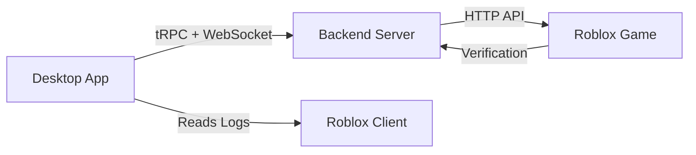

## Introduction

BloxChat is a Windows desktop chat companion for Roblox games. While the official hosted version is available at [bloxchat.logix.lol](https://bloxchat.logix.lol), you can self-host your own instance for complete control over your infrastructure, data, and customization.

## Why Self-Host?

Self-hosting BloxChat gives you:

<CardGroup cols={2}>
  <Card title="Full Control" icon="server">
    Manage your own backend infrastructure and data storage
  </Card>
  <Card title="Privacy" icon="shield">
    Keep all chat data on your own servers
  </Card>
  <Card title="Customization" icon="wrench">
    Modify rate limits, message lengths, and behavior
  </Card>
  <Card title="Integration" icon="plug">
    Integrate with your own Roblox games and verification systems
  </Card>
</CardGroup>

## Architecture Overview

BloxChat consists of three main components:



### Components

<Steps>
  <Step title="Desktop Application">
    A Tauri-based Windows app built with React and Vite. Users install and run this on their machines.
    
    **Tech Stack:**
    - Frontend: React + Vite + TypeScript
    - Desktop Framework: Tauri (Rust)
    - Communication: tRPC client over HTTP and WebSocket
  </Step>

  <Step title="Backend Server">
    A Bun server that hosts the tRPC API for authentication and real-time chat.
    
    **Tech Stack:**
    - Runtime: Bun
    - API: tRPC with HTTP and WebSocket adapters
    - Auth: JWT-based sessions
    - Storage: In-memory (sessions, chat messages)
  </Step>

  <Step title="Roblox Game Integration">
    Your Roblox game must integrate with the backend to complete user verification.
    
    **Requirements:**
    - HTTP requests from game server scripts
    - Verification secret header authentication
    - Integration with verification place
  </Step>
</Steps>

## System Requirements

To self-host BloxChat, you'll need:

### Development Environment

<AccordionGroup>
  <Accordion title="Required Software">
    - **Operating System**: Windows 10/11 (for development)
    - **Bun**: v1.3.8 (pinned version)
    - **Node.js**: v18 or higher
    - **Rust**: v1.88.0 (specified in `rust-toolchain.toml`)
    - **MSVC Build Tools**: For Windows compilation
    - **WebView2 Runtime**: For Tauri desktop app
  </Accordion>

  <Accordion title="Production Server">
    - **Operating System**: Linux (recommended) or Windows
    - **Bun**: v1.3.8 or higher
    - **Node.js**: v18 or higher
    - **Memory**: Minimum 512MB RAM (more for high traffic)
    - **Storage**: Minimal (all data is in-memory)
  </Accordion>

  <Accordion title="Roblox Requirements">
    - A Roblox place ID for verification
    - HTTP request permissions enabled in game
    - Server-side script access
  </Accordion>
</AccordionGroup>

## Security Considerations

<Warning>
  Self-hosting requires careful security setup. Follow these best practices:
</Warning>

### Critical Security Measures

<Steps>
  <Step title="Generate Strong Secrets">
    Use cryptographically secure random strings for all secrets:
    
    ```bash
    # JWT_SECRET (32-64 characters)
    openssl rand -base64 48
    
    # VERIFICATION_SECRET (64+ characters)
    openssl rand -base64 64
    ```
  </Step>

  <Step title="Protect Environment Variables">
    Never commit `.env` files to version control. Add to `.gitignore`:
    
    ```bash
    echo "apps/server/.env" >> .gitignore
    ```
  </Step>

  <Step title="Secure Verification Secret">
    The `VERIFICATION_SECRET` must be:
    - Stored securely in both backend `.env` and Roblox game
    - Never exposed to clients
    - Sent only in `x-verification-secret` header from game servers
  </Step>

  <Step title="Use HTTPS in Production">
    Deploy behind a reverse proxy (nginx, Caddy) with SSL/TLS:
    - Obtain SSL certificate (Let's Encrypt recommended)
    - Configure HTTPS on port 443
    - Redirect HTTP to HTTPS
  </Step>

  <Step title="Configure CORS">
    The backend uses CORS middleware. In production, restrict origins if needed.
  </Step>
</Steps>

## Data Storage

<Note>
  BloxChat stores all data **in-memory**. When the server restarts:
  - All chat messages are lost
  - Active sessions are invalidated
  - Users must re-verify
</Note>

This design prioritizes:
- **Privacy**: No persistent chat logs
- **Simplicity**: No database setup required
- **Performance**: Fast message delivery

If you need persistent storage, you'll need to modify the source code to add a database.

## Next Steps

<CardGroup cols={2}>
  <Card title="Server Setup" icon="server" href="/self-hosting/server-setup">
    Install dependencies and run the backend server
  </Card>
  <Card title="Environment Variables" icon="gear" href="/self-hosting/environment-variables">
    Configure all required and optional settings
  </Card>
  <Card title="Game Integration" icon="gamepad" href="/self-hosting/game-integration">
    Connect your Roblox game to the backend
  </Card>
  <Card title="Desktop App" icon="desktop" href="/self-hosting/desktop-app">
    Build and distribute the desktop client
  </Card>
</CardGroup>

## Support

For issues and questions:
- Check the [GitHub repository](https://github.com/logixism/bloxchat)
- Review the source code in `apps/server/` and `packages/api/`
- Open an issue for bugs or feature requests